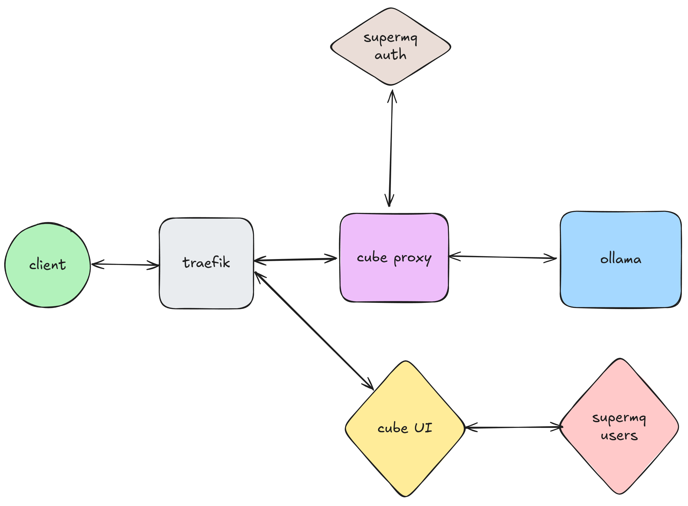

# Architecture

Cube AI implements a layered architecture with multiple components working together to provide secure, authenticated access to AI models. The system uses SuperMQ for user management, supports multiple LLM backends (Ollama and vLLM), and implements a three-layer proxy architecture for routing and security.



## Routing Architecture

Cube AI uses a **three-layer routing architecture** to provide secure, authenticated, and flexible access to AI models:

```
External Client (HTTPS)
        ↓
   [Layer 1: Traefik]
   - TLS termination and SSL certificates (Let's Encrypt)
   - Entry point routing and load balancing
   - Health check monitoring
        ↓
   [Layer 2: Cube Proxy]
   - Attested TLS (aTLS) support for confidential computing
   - Custom header injection (X-Attested-Tls, X-Product-Name)
   - Metrics and distributed tracing
        ↓
   [Layer 3: Cube Agent]
   - Authentication verification (via SuperMQ Auth gRPC)
   - Advanced rule-based routing engine
   - Audit logging and compliance tracking
   - Dynamic backend selection
        ↓
   Backend Services (Ollama / vLLM)
```

### Layer 1: Traefik

Traefik serves as the entry point for all external requests, handling:

- **TLS/SSL termination** with automatic certificate management via Let's Encrypt
- **HTTP to HTTPS redirects** for secure communication
- **Path-based routing** with priority support
- **Health check based load balancing** for backend services
- **Middleware chains** for retry logic and security headers

All Cube AI API requests are routed through the `/proxy` path prefix, which Traefik strips before forwarding to the Cube Proxy service.

### Layer 2: Cube Proxy

The Cube Proxy acts as a secure gateway between Traefik and the Cube Agent, providing:

- **Attested TLS (aTLS)** support for confidential computing environments
- **Header modification** to add security and identification headers
- **OpenTelemetry integration** for distributed tracing to Jaeger
- **Prometheus metrics** for monitoring request latency and throughput

The proxy forwards authenticated requests to the Cube Agent for intelligent routing.

### Layer 3: Cube Agent

The Cube Agent is a sophisticated routing engine that provides:

- **Authentication middleware** that verifies JWT tokens against SuperMQ Auth service via gRPC
- **Rule-based routing** with support for multiple matching conditions:
  - Path patterns (regex supported)
  - HTTP methods
  - Request headers
  - Query parameters
  - JSON body fields (with dot notation for nested fields)
- **Priority-based route evaluation** for predictable routing behavior
- **Default route fallback** for unmatched requests
- **Audit logging** with PII detection, token tracking, and compliance tagging
- **Dynamic route management** (add/remove routes at runtime)

The Agent routes requests to the configured LLM backend (Ollama or vLLM) based on routing rules defined in `/etc/cube/agent/config.json`.

## SuperMQ

Cube AI uses SuperMQ Users and Auth Service to manage users and authentication. SuperMQ is an IoT platform that provides a secure and scalable way to manage IoT devices. Since SuperMQ is based on micro-service architecture, auth and users are separated from the core application. This allows for better scalability and security.

SuperMQ is responsible for:

- **User authentication** via JWT tokens
- **User authorization** and permission checking via gRPC
- **User management** including registration, password reset, and verification
- **Domain-based access control** for multi-tenancy support

The Cube Agent communicates with the SuperMQ Auth service over gRPC to verify authentication tokens on every request (except health and metrics endpoints).

## LLM Backends

Cube AI supports multiple LLM backend options:

### Ollama

Ollama is a framework that provides a unified interface for interacting with different LLMs. Ollama is responsible for:

- **Managing LLMs** and their configurations locally
- **Model deployment** with easy pull and run commands
- **OpenAI-compatible API** for standardized inference
- **Local inference** without external dependencies

Ollama provides endpoints like `/api/tags`, `/api/generate`, `/api/chat`, and OpenAI-compatible `/v1/chat/completions`.

### vLLM

vLLM is a high-performance inference engine for Large Language Models, offering:

- **High throughput** with continuous batching and optimized memory management
- **GPU acceleration** with CUDA kernels for fast inference
- **Memory efficiency** using PagedAttention and other advanced techniques
- **Model compatibility** with LLaMA, Mistral, Qwen, and more
- **OpenAI-compatible API** for easy integration

## Request Flow

A typical authenticated request flows through the system as follows:

1. **Client** makes HTTPS request to `https://localhost/proxy/v1/chat/completions` with `Authorization: Bearer <token>`
2. **Traefik** (Layer 1) terminates TLS, strips `/proxy` prefix, routes to Cube Proxy
3. **Cube Proxy** (Layer 2) adds custom headers, forwards to Cube Agent
4. **Cube Agent** (Layer 3):
   - Verifies JWT token with SuperMQ Auth service via gRPC
   - Logs audit event with request details, PII detection
   - Evaluates routing rules to determine target backend
   - Forwards request to selected backend (Ollama or vLLM)
5. **LLM Backend** processes the request and returns response
6. **Response** flows back through Agent → Proxy → Traefik → Client

All requests are logged to OpenSearch via Fluent-Bit for audit trails and compliance.
